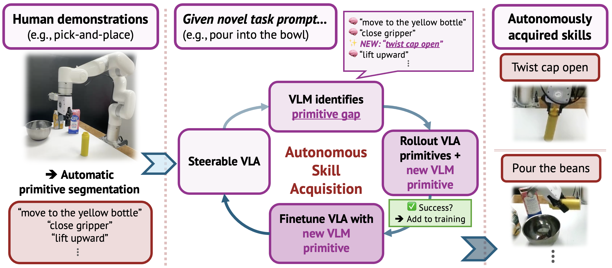

<div align="center">

# InSight

**Self-Guided Skill Acquisition via Steerable Vision-Language-Action Models**

[[Paper]](https://arxiv.org/abs/2606.24884) &emsp; [[Project Page]](https://insight-vla.github.io/)

Maggie Wang¹, Lars Osterberg¹, Stephen Tian¹, Ola Shorinwa², Jiajun Wu¹, Mac Schwager¹

¹ Stanford University &emsp; ² Princeton University



</div>

## Overview

**InSight** is a framework for **self-guided skill acquisition** in
Vision-Language-Action (VLA) models. It renders a VLA *steerable at the
primitive-action level* (e.g. "move gripper to bowl", "lift upward", "pour the
bottle") and then uses a VLM-guided data flywheel to identify primitives that
are missing from a novel task ("primitive gaps"), execute them with VLM-proposed
low-level controllers, verify them with a VLM oracle, and retrain the VLA on
the resulting rollouts &mdash; *enabling continual skill acquisition without
any human demonstrations of the target skill*.

The pipeline has two stages:

1. **Stage 1 &mdash; Steerable VLA training.** A VLM segments human demonstrations
   into primitive-labeled episodes (gripper-velocity boundary seeding, per-frame
   motion captions, VLM frame-by-frame alignment, localized boundary refinement).
   `pi_0.5` is then LoRA-fine-tuned (Gemma-2B backbone + Gemma-300M action
   expert, two 224x224 RGB views) to output end-effector deltas, an absolute
   gripper command, and a learned scalar progress channel.

2. **Stage 2 &mdash; VLM-guided flywheel.** A planner VLM decomposes a new task
   into a primitive sequence and flags any step not in the current primitive
   vocabulary V as a single-axis skill gap. A pre-execution VLM proposes the
   `(axis, signed magnitude)` for each gap, a scripted controller executes it,
   and a VLM oracle compares before/after images. Accepted rollouts are added
   to the dataset and the VLA is retrained on V ∪ {new primitive}.

---

## Repository structure

```
insight/
├── README.md                 # this file
├── LICENSE                   # Apache-2.0
├── NOTICE                    # third-party attribution
├── pyproject.toml            # unified uv environment
├── docs/                     # installation, safety, datasets, checkpoints
│
├── src/
│   ├── insight/              # shared VLM-reasoning package
│   └── openpi/               # pi_0.5 VLA codebase
│       ├── models/, models_pytorch/
│       ├── policies/         # libero, lego, xarm, xarm_prim
│       ├── training/         # train.py is at top-level training/
│       │   ├── config.py     # thin shim merging sim + xarm registries
│       │   ├── sim_configs.py
│       │   └── xarm_configs.py
│       ├── serving/
│       └── shared/
│
├── packages/openpi-client/   # lightweight remote-inference client
│
├── sim/
│   └── libero_flywheel/      # block-flip + drawer-close flywheel
│
├── real/
│   ├── xarm_flywheel/        # planner + executor + oracle + hardware
│   ├── entry/                # tyro CLI shims (run_flywheel.py, etc.)
│   ├── runs/                 # paper experiment launch scripts
│   └── calibration/          # bounds_sweep.json
│
├── training/                 # shared train.py + compute_norm_stats.py + serve_policy.py
└── cluster/                  # SLURM launch scripts used to produce paper checkpoints
```

---

## Installation

InSight uses **`uv`** for environment management. Install `uv` first
([astral.sh/uv](https://docs.astral.sh/uv/)). Python 3.11 is required.

Datasets and pre-trained checkpoints aren't bundled in the repository.
See [`docs/dataset_setup.md`](docs/dataset_setup.md) and
[`docs/checkpoint_setup.md`](docs/checkpoint_setup.md) for the expected
layouts; download links will be added once they're publicly hosted.

### 1. Clone the repo and initialize submodules

```bash
git clone <repo-url> insight
cd insight
git submodule update --init --recursive   # fetches libero-insight
```

### 2. Create the main environment

```bash
uv sync                      # core deps (JAX, flax, lerobot, openpi-client, openai, google-auth, hardware drivers)
uv sync --group rlds         # (optional) RLDS / DROID dataset support
```

The xArm hardware stack (`pyrealsense2`, `xarm-python-sdk`) is included in the
main `dependencies` block of `pyproject.toml`. If you don't have hardware, you
can still run the JAX training + sim pipelines.

> **Note &mdash; av==14.2.0 pin.** xArm-openpi pins `av==14.2.0` because PyAV
> 14.3/14.4 are sdist-only and Ubuntu 22.04 (jammy) ships an older ffmpeg.
> Honor this pin even if `uv lock` suggests bumping.

### 3. Note on LIBERO

The original LIBERO benchmark historically required Python 3.8; the
[`libero-insight`](https://github.com/insight-vla/libero-insight) fork used
here works under 3.11 via the main env.

See [`docs/installation.md`](docs/installation.md) for full installation
details (submodules, sanity checks).

---

## Quickstart

### Set required API keys

The VLM client (Gemini 3 Flash) reads its credentials from environment
variables. Set them in `.env` (gitignored) or your shell:

```bash
# Default `gemini` provider uses Vertex AI:
gcloud auth application-default login
export VERTEX_PROJECT=<your-gcp-project>
# (For a direct Gemini API key, edit src/insight/vlm_client.py and set GEMINI_API_KEY)
export WANDB_API_KEY=...       # for cluster training scripts
export HF_TOKEN=...            # for huggingface dataset access
```

### Serve a trained policy

```bash
uv run python training/serve_policy.py \
  policy:checkpoint \
  --policy.config xarm_pick_from_top_v5 \
  --policy.dir checkpoints/xarm_pick_from_top_v5/xarm_pick_from_top_v5_h200/15000
```

---

## Running the experiments

### Simulation: block-flip and drawer-close (LIBERO)

The unified entry point is `sim/libero_flywheel/vlm_feedback_flywheel.py`
(a thin tyro shim over `vlm_flywheel.flywheel_execution.main`):

```bash
# Block-flip (acquires rotate-block primitive from pick-and-place demos)
uv run python sim/libero_flywheel/vlm_feedback_flywheel.py \
  --args.task lego \
  --args.seed 0 \
  --args.num_runs 50 \
  --args.target_successes 30 \
  --args.vlm gemini \
  --args.record

# Drawer-close (acquires push-drawer-closed primitive from drawer-open demos)
uv run python sim/libero_flywheel/vlm_feedback_flywheel.py \
  --args.task drawer \
  --args.seed 0 \
  --args.num_runs 50 \
  --args.target_successes 30 \
  --args.vlm gemini \
  --args.record
```

This expects a policy server (e.g. `training/serve_policy.py`) running on
`localhost:8000` and a Gemini API key.

### Real hardware (xArm 6): twist, pour, twist-then-pour

> **SAFETY.** Before powering on the xArm, read
> [`docs/safety.md`](docs/safety.md). Keep an e-stop in hand, supervise every
> rollout, and confirm `--workspace-bounds` and `--max-tcp-speed-mm-s` are set
> conservatively.

End-to-end paper launches live in `real/runs/`:

```bash
# Twist (acquisition pass &mdash; collects new primitive demos)
bash real/runs/run_twist_pre_vla.sh

# Twist (post-VLA evaluation &mdash; uses the retrained policy)
bash real/runs/run_twist_post_vla.sh

# Pour (acquisition + evaluation)
bash real/runs/run_pour_pre_vla.sh
bash real/runs/run_pour_post_vla.sh

# Composition: twist-then-pour with the unified VLA
bash real/runs/run_unified_twist_pour.sh

# Base pick-and-place retention checks
bash real/runs/run_base_top_pickplace.sh
bash real/runs/run_base_side_pickplace.sh
```

The **sweep** experiment (from scooping demos) doesn't have a bundled `run_sweep.sh` wrapper — it's invoked directly through `real/entry/run_flywheel.py` with a `--goal "sweep the rocks"` argument and the scoop primitives passed via `--available-primitives`. The trained policy (post-VLA, after the sweeping primitive is acquired) lives under `cluster/real/train_scoop_to_sweep.sh`.

The general direct CLI form (illustrated here for **twist** — substitute your own `--goal` and `--available-primitives` for sweep or any other task):

```bash
uv run python real/entry/run_flywheel.py \
  --goal "twist open the cap of the yellow bottle..." \
  --scene-context "Tabletop with a capped yellow bottle..." \
  --available-primitives \
    "move gripper to the top of the yellow bottle" \
    "close gripper" "lift upward" "lower gripper" "open gripper" \
  --experiment-name twist_pre_vla \
  --num-runs 40 --target-successes 20 \
  --use-progress-check --progress-threshold 0.95 \
  --max-tcp-speed-mm-s 100 \
  --workspace-bounds 200 500 -230 170 200 450
```

To run only a known-primitive sequence (no skill-gap planning), use
`real/entry/run_primitives.py`.

---

## Training and fine-tuning

Training is unified across sim and real via `training/train.py` (JAX) /
`training/train_pytorch.py`. Config names live in
`src/openpi/training/sim_configs.py` (LIBERO / LEGO / xArm sim primitives) and
`src/openpi/training/xarm_configs.py` (xArm real-hardware), and are merged by
`src/openpi/training/config.py`.

Workflow:

```bash
# 1) Compute normalization stats for a config
uv run python training/compute_norm_stats.py --config-name pi05_lego_oracle_flip_140_primitives

# 2) Train (JAX, with FSDP across multiple GPUs)
uv run python training/train.py pi05_lego_oracle_flip_140_primitives \
  --exp-name=my_run --batch-size 32 --fsdp-devices 2

# 3) Serve the resulting checkpoint
uv run python training/serve_policy.py policy:checkpoint \
  --policy.config pi05_lego_oracle_flip_140_primitives \
  --policy.dir checkpoints/pi05_lego_oracle_flip_140_primitives/my_run/30000
```

Many SLURM submission scripts that produced the paper checkpoints are in
`cluster/` &mdash; see [`cluster/README.md`](cluster/README.md). They are
kept for reference and may need path adjustments.

---

## Primitive segmentation

The automatic primitive-segmentation pipeline (Stage 1) is in
`sim/libero_flywheel/data_processing/` (densely-label-dataset entry point) and
in `src/insight/reasoning.py` / `src/insight/prompts.py` for the VLM prompts.
The xArm dataset preprocessors that consume these labels live in
`training/preprocess/`:

```bash
# Example: build a primitive-labeled training set from raw flywheel rollouts
uv run python training/preprocess/preprocess_all_primitives.py \
  --source data/raw_demos --output data/lerobot_primitives
```

---

## Skill acquisition (VLM-guided flywheel)

Stage 2 is the VLM-guided flywheel: a planner VLM decomposes the task and
flags any missing primitives, a pre-analysis call proposes a scripted
single-axis controller for each gap, the VLA executes the known primitives,
and a VLM oracle accepts or rejects each rollout. Successful rollouts are
added to the dataset and the VLA is retrained on the expanded primitive set.

- Sim entry point: `sim/libero_flywheel/vlm_feedback_flywheel.py`
- Real entry point: `real/entry/run_flywheel.py`
- Shared reasoning + prompts: `src/insight/`

---

## Evaluation

Both flywheel entry points double as evaluation harnesses — each rollout is
scored per-primitive and per-task, and the underlying logs are written
alongside the acquired demos. For interactive review of real-robot
rollouts, pass `--manual-verdict` to override the VLM oracle's judgment.

---

## Citation

```bibtex
@misc{wang2026insight,
  title         = {InSight: Self-Guided Skill Acquisition via Steerable Vision-Language-Action Models},
  author        = {Wang, Maggie and Osterberg, Lars and Tian, Stephen and
                   Shorinwa, Ola and Wu, Jiajun and Schwager, Mac},
  year          = {2026},
  eprint        = {2606.24884},
  archivePrefix = {arXiv},
  primaryClass  = {cs.RO},
  url           = {https://arxiv.org/abs/2606.24884}
}
```

---

## Acknowledgments and third-party components

InSight builds on the following prior work:

- **`pi_0.5`** &mdash; the underlying VLA, from
  [Physical Intelligence openpi](https://github.com/Physical-Intelligence/openpi)
  (Apache-2.0). `src/openpi/` is a fork.
- **Gemma** weights and tokenizer, used by the pi-0.5 backbone.
- **LIBERO** &mdash; the simulation benchmark. We use the
  [`libero-insight`](https://github.com/insight-vla/libero-insight) fork that
  adds drawer-primitive BDDLs.
- **LeRobot** ([huggingface/lerobot](https://github.com/huggingface/lerobot))
  &mdash; dataset format and loaders.
- **Gemini 3 Flash** &mdash; the planner / proposer / oracle VLM.
- **UFactory xArm Python SDK** &mdash; real-robot driver.

---

## License

This repository is released under the **Apache License, Version 2.0**. See
[`LICENSE`](LICENSE) for the full terms and [`NOTICE`](NOTICE) for third-party
attributions (openpi, LIBERO, LeRobot, Gemma, etc.). Gemma model weights,
when downloaded separately, are governed by the Gemma Prohibited Use Policy.
